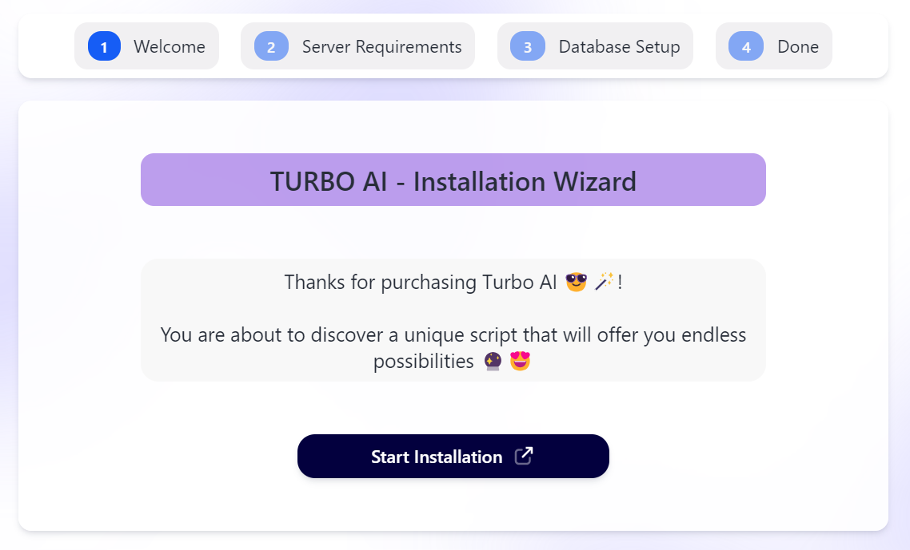
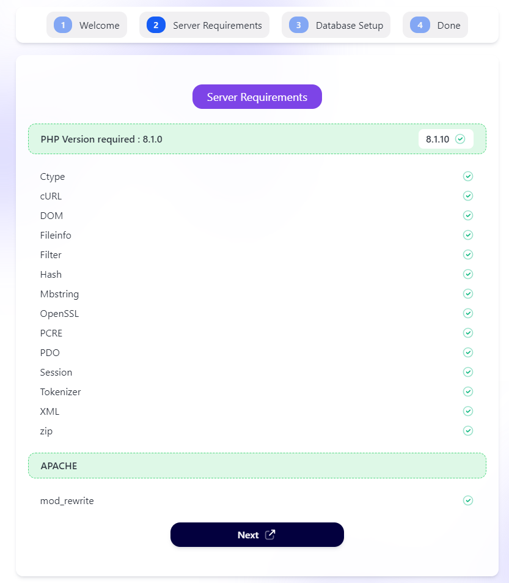
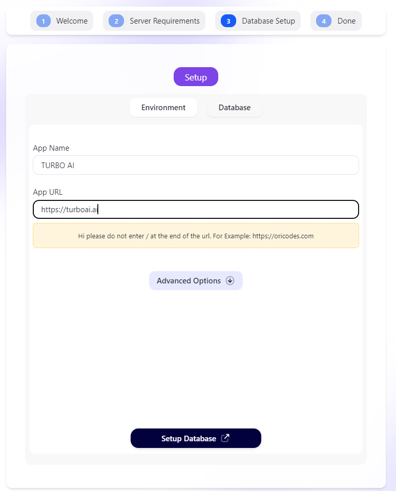
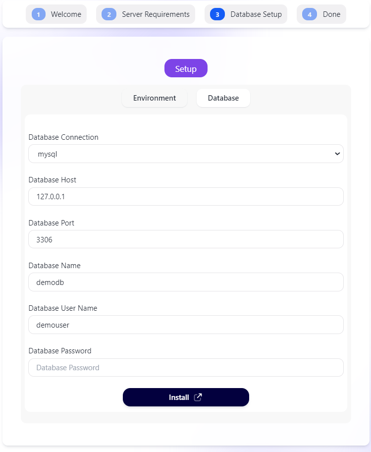
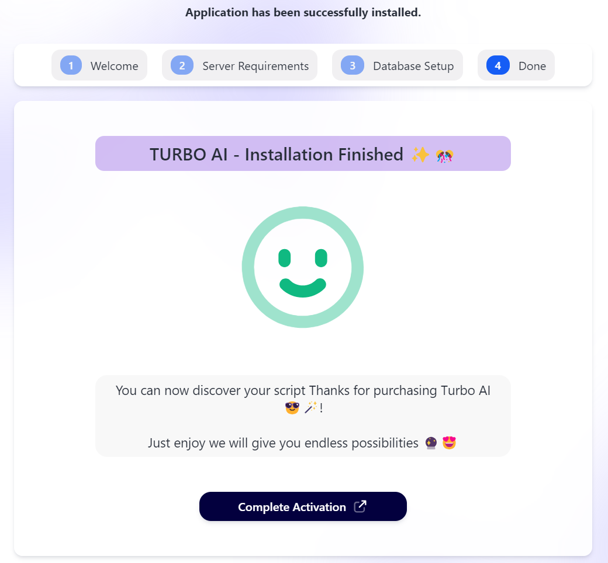

# 💡 Installation


**Please be sure your hosting allow you to boost all your config to max**


## Server Requirements:

* Apache server (for the htaccess rewrite rules to work)
* PHP 8.1 or higher
* MariaDB 10.5 or higher / MySQL 5.7 or higher

## Required PHP Extension

* Ctype PHP Extension
* cURL PHP Extension
* DOM PHP Extension
* Fileinfo PHP Extension
* Filter PHP Extension
* Hash PHP Extension
* Mbstring PHP Extension
* OpenSSL PHP Extension
* PCRE PHP Extension
* PDO PHP Extension
* Session PHP Extension
* Tokenizer PHP Extension
* XML PHP Extension
* Zip PHP Extension

***

## Installation

### Auto Installation

1. Go to your-domain.com Eg: turbo.ai
2.  Click on Start Installation Button

    <figure><figcaption></figcaption></figure>
3.  If your server is compatible with this script, All Server requirements will be checked, click on "Next" Button to go to next Step

    <figure><figcaption></figcaption></figure>
4.  Here you can enter your site name and your site url, don't add "/" in the end of your site or this script asset will be break :smile:

    <figure><figcaption></figcaption></figure>
5.  Here you can enter all your database information and click on "Install" button to start installation

    <figure><figcaption></figcaption></figure>
6.  In The end of your installation you will see this page, you can click on "Complete Activation" button to go to your site&#x20;

    <figure><figcaption></figcaption></figure>

## It's okay your site is ready :tada::smile:

Now you can go to your-site-com/login and use this default crdentials :&#x20;

Mail :  <mark style="background-color:red;">turboai@oricodes.com</mark>

Password : <mark style="background-color:red;">12345678</mark>
